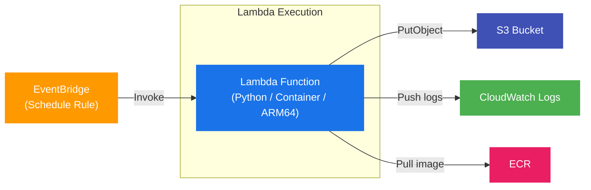
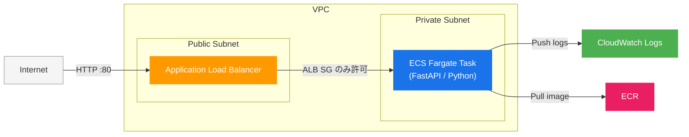

# AWS CDK テンプレート集

部門内で共通利用できる AWS CDK テンプレートを、**用途ごとのフォルダ**に整理しています。
新しいプロジェクトを始める際に、近い構成のテンプレートをコピーしてすぐに使い始められます。

---

## なぜ用途ごとに分けるのか

```
┌─────────────────────────────────────────────────────────────────────┐
│                        aws-template リポジトリ                       │
│                                                                      │
│  ┌──────────────┐  ┌──────────────┐  ┌──────────────┐              │
│  │  ecs-lambda  │  │  ecs-webapp  │  │  (次のテンプ  │   ...        │
│  │              │  │              │  │   レート)      │              │
│  │ バッチ処理   │  │ Web アプリ   │  │              │              │
│  │  テンプレート │  │  テンプレート │  │              │              │
│  └──────┬───────┘  └──────┬───────┘  └──────────────┘              │
│         │                 │                                          │
└─────────┼─────────────────┼──────────────────────────────────────────┘
          │                 │
     コピーして使う    コピーして使う
          │                 │
  ┌───────┴──────┐   ┌──────┴────────┐
  │  チームAの   │   │  チームBの    │
  │ バッチ処理   │   │  Web サービス │
  └──────────────┘   └───────────────┘
```

### メリット

| # | メリット | 内容 |
|---|---|---|
| 1 | **すぐ動く** | 動作確認済みの構成をコピーするだけでデプロイできる |
| 2 | **設定だけ変えればいい** | `app-config.json` を編集するだけでプロジェクト名・スペックを切り替え可能 |
| 3 | **ベストプラクティスが標準に** | セキュリティ設定・ログ設定・IAM 最小権限などを最初から組み込み済み |
| 4 | **属人化を防ぐ** | 構成の背景や使い方を README にまとめており、誰でも同じように使える |
| 5 | **横展開が簡単** | 別の用途が必要になったら、既存テンプレートを参考に新フォルダを追加するだけ |

---

## テンプレート一覧

| フォルダ | 用途 | 主なサービス |
|---|---|---|
| [ecs-lambda](./ecs-lambda/) | 定期バッチ処理 | EventBridge / Lambda / S3 / ECR |
| [ecs-webapp](./ecs-webapp/) | Web アプリケーション | ECS Fargate / ALB / VPC / ECR |
| [other-use-case](./other-use-case/) | （追加テンプレートの例） | — |

---

## ecs-lambda — 定期バッチ処理テンプレート

EventBridge のスケジュールで Lambda（コンテナイメージ）を定期実行し、処理結果を S3 に保存する構成です。

### アーキテクチャ



### こんな用途に向いている

- **データ収集・加工**：外部 API からデータを取得して S3 に蓄積
- **レポート生成**：毎日・毎時の集計処理をスケジュール実行
- **ファイル変換・クリーニング**：S3 のファイルを定期的に変換・整形

### ポイント

- Lambda をコンテナイメージで動かすため、Python ライブラリを自由に追加できる
- ARM64 (Graviton) を採用しコスト最適化済み
- `eventBridge.enabled: false` でデフォルト無効にしているため、意図しない実行が起きない
- `cdk destroy` で S3 バケットごとクリーンに削除される

詳細は [ecs-lambda/README.md](./ecs-lambda/README.md) を参照

---

## ecs-webapp — Web アプリケーションテンプレート

ALB + ECS Fargate で FastAPI アプリをインターネット公開する構成です。プライベートサブネットに ECS タスクを配置し、ALB 経由でのみアクセスを受け付けるセキュアな構成になっています。

### アーキテクチャ



### こんな用途に向いている

- **社内ツール・管理画面**：認証基盤と組み合わせた内部向け Web アプリ
- **API サーバー**：モバイルアプリやフロントエンドのバックエンド API
- **PoC・デモ環境**：素早くアプリを公開して動作確認したい場合

### ポイント

- ECS タスクはプライベートサブネットに置くため、直接インターネットには晒されない
- ALB のセキュリティグループのみ ECS への通信を許可する構成
- `app-config.json` で CPU・メモリ・タスク数を簡単に変更できる
- CDK DockerImageAsset でイメージのビルド〜ECR プッシュ〜デプロイを一括で行う

> **注意:** このテンプレートは HTTP:80 のみ対応です。本番利用や機密情報を扱う場合は HTTPS（ACM + ALB リスナー）を別途追加してください。

詳細は [ecs-webapp/README.md](./ecs-webapp/README.md) を参照

---

## テンプレートの使い方

```bash
# 1. リポジトリをクローン
git clone <this-repo>

# 2. 使いたいテンプレートフォルダをコピー
cp -r ecs-lambda /path/to/your-project

# 3. app-config.json を編集してプロジェクト設定を変更
cd your-project
vi app-config.json

# 4. 依存パッケージをインストール
npm install

# 5. Bootstrap（初回のみ）
cdk bootstrap

# 6. デプロイ
cdk deploy
```

---

## 新しいテンプレートを追加するには

用途が増えた場合は、既存テンプレートを参考に新しいフォルダを作成してください。

```
aws-template/
├── ecs-lambda/       # 既存テンプレート
├── ecs-webapp/       # 既存テンプレート
└── your-new-case/    # 新しい用途のテンプレートをここに追加
    ├── README.md     # 用途・アーキテクチャ・使い方を記載
    ├── app-config.json
    ├── bin/
    ├── lib/
    └── ...
```

**README に書くべきこと：**
1. 用途（どんな場面で使うか）
2. アーキテクチャ図（Mermaid 推奨）
3. セットアップ〜デプロイ手順
4. `app-config.json` のパラメータ説明
