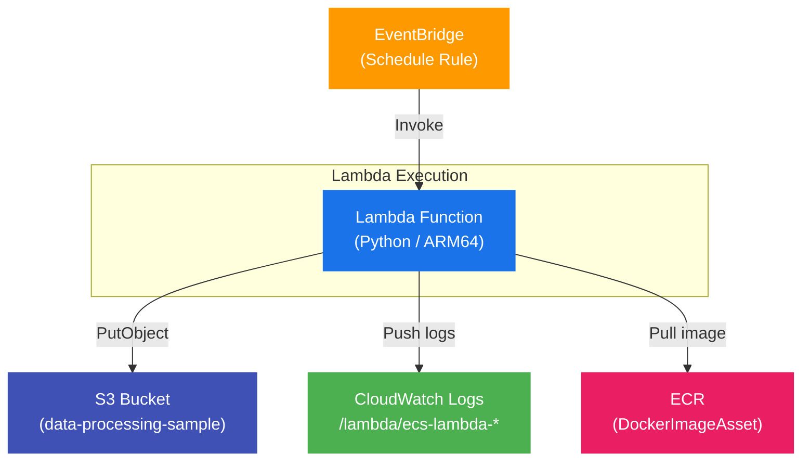

# ecs-lambda

AWS CDK v2 (TypeScript) を使った EventBridge + Lambda（Container Image）+ S3 構成のテンプレートです。

---

## 用途

- EventBridge スケジュールで定期実行される Lambda（Python・コンテナイメージ）のテンプレート
- 実行のたびに UTC 日時ファイル名で S3 にファイルを出力するサンプル処理
- `app-config.json` を編集するだけで、プロジェクト名・ステージ・スペック・スケジュールを切り替え可能

---

## アーキテクチャ



| リソース | 設定 |
|---|---|
| EventBridge | スケジュール実行 / デフォルト無効 |
| Lambda | Container Image / ARM64 / 512MiB / timeout:60s |
| S3 | データ処理サンプル用 / CDK とともに廃棄 |
| CloudWatch Logs | `/lambda/ecs-lambda-{stage}-data-processor` / 7日保持 |
| ECR | CDK DockerImageAsset で自動プッシュ |

---

## フォルダ構成

```
ecs-lambda/
├── lambda/                          # Lambda アプリケーション
│   ├── Dockerfile
│   ├── handler.py
│   ├── requirements.in              # 直接依存パッケージ
│   └── requirements.txt             # pip-compile で生成
├── bin/
│   └── ecs-lambda.ts                # CDK App エントリーポイント
├── lib/
│   └── ecs-lambda-stack.ts          # Stack 定義
├── app-config.json                  # プロジェクト・スタック設定
├── cdk.json
├── package.json
└── tsconfig.json
```

---

## セットアップからデプロイまで

### 1. 前提条件

```bash
# Node.js (v18 以上)
node --version

# AWS CDK CLI
npm install -g aws-cdk
cdk --version

# AWS CLI
aws --version

# Docker（Lambda イメージビルドに必要）
docker --version
```

### 2. AWS 認証設定

```bash
aws configure
# AWS Access Key ID:
# AWS Secret Access Key:
# Default region name: ap-northeast-1
# Default output format: json
```

### 3. 依存パッケージのインストール

```bash
cd ecs-lambda
npm install
```

### 4. 設定の編集

`app-config.json` を編集してプロジェクト情報・スタックパラメータを設定します。

> `s3.bucketName` は AWS 全体で一意な名前にしてください。

```json
{
  "project": {
    "name": "ecs-lambda",
    "stage": "dev",
    "description": "EventBridge triggered Lambda (Container Image) with S3"
  },
  "stack": {
    "s3": { "bucketName": "data-processing-sample-dev-123456" },
    "logs": { "retentionDays": 7 },
    "lambda": {
      "functionName": "data-processor",
      "architecture": "ARM64",
      "memorySize": 512,
      "timeoutSeconds": 60,
      "environment": { "LOG_LEVEL": "INFO" }
    },
    "eventBridge": {
      "scheduleExpression": "rate(1 hour)",
      "enabled": false
    }
  }
}
```

### 5. Bootstrap（初回のみ）

```bash
cdk bootstrap
```

### 6. ビルド確認

```bash
npm run build
cdk synth
```

### 7. デプロイ

```bash
cdk deploy
```

デプロイ完了後、出力で Lambda 関数名と S3 バケット名を確認できます。

```
Outputs:
EcsLambdaStack.LambdaFunctionName = ecs-lambda-dev-data-processor
EcsLambdaStack.S3BucketName       = data-processing-sample-dev-123456
```

### 8. 手動実行

```bash
aws lambda invoke \
  --function-name ecs-lambda-dev-data-processor \
  --payload '{}' \
  response.json && cat response.json
```

### 9. 削除

```bash
cdk destroy
```

---

## ローカル動作確認

```bash
cd lambda
docker build -t ecs-lambda .
docker run --rm \
  -e BUCKET_NAME=your-bucket \
  -e LOG_LEVEL=DEBUG \
  -e AWS_ACCESS_KEY_ID=xxx \
  -e AWS_SECRET_ACCESS_KEY=xxx \
  -e AWS_DEFAULT_REGION=ap-northeast-1 \
  -p 9000:8080 ecs-lambda

# 別ターミナルで呼び出し
curl -X POST http://localhost:9000/2015-03-31/functions/function/invocations \
  -d '{}'
```

---

## CDK 主要コマンド

| コマンド | 内容 |
|---|---|
| `npm run build` | TypeScript をコンパイル |
| `npm run watch` | ウォッチモードでコンパイル |
| `cdk synth` | CloudFormation テンプレートを生成 |
| `cdk diff` | デプロイ済みスタックとの差分確認 |
| `cdk deploy` | デプロイ |
| `cdk destroy` | スタック削除 |
