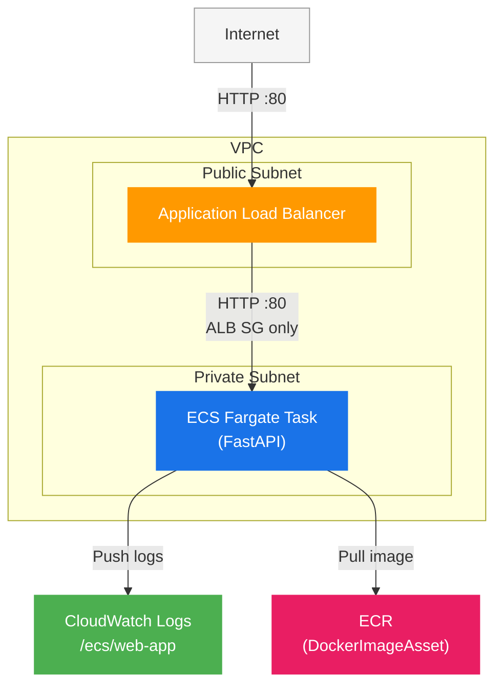

# ecs-webapp

AWS CDK v2 (TypeScript) を使った ECS Fargate ベースの Web アプリケーションテンプレートです。

---

## 用途

- FastAPI アプリケーションを ECS Fargate でホスティングする構成のテンプレート
- ALB でインターネット公開し、プライベートサブネットの ECS タスクにルーティング
- `app-config.json` を編集するだけで、プロジェクト名・ステージ・スペックを切り替え可能

---

## アーキテクチャ



| リソース | 設定 |
|---|---|
| VPC | 2AZ / NAT×1 / public・private サブネット |
| ALB | インターネット公開 / HTTP:80 |
| ECS | Fargate / 256CPU / 512MiB / desiredCount:1 |
| CloudWatch Logs | `/ecs/web-app` / 7日保持 |
| ECR | CDK DockerImageAsset で自動プッシュ |

---

## フォルダ構成

```
ecs-webapp/
├── app/                         # FastAPI アプリケーション
│   ├── Dockerfile
│   ├── main.py
│   ├── requirements.in          # 直接依存パッケージ
│   ├── requirements.txt         # pip-compile で生成
│   └── templates/
│       └── index.html
├── bin/
│   └── ecs-webapp.ts            # CDK App エントリーポイント
├── lib/
│   └── ecs-webapp-stack.ts      # Stack 定義
├── app-config.json              # プロジェクト・スタック設定
├── cdk.json
├── package.json
└── tsconfig.json
```

---

## セットアップからデプロイまで

### 1. 前提条件

```bash
# Node.js (v18 以上)
node --version

# AWS CDK CLI
npm install -g aws-cdk
cdk --version

# AWS CLI
aws --version

# Docker（ECS イメージビルドに必要）
docker --version
```

### 2. AWS 認証設定

```bash
aws configure
# AWS Access Key ID:
# AWS Secret Access Key:
# Default region name: ap-northeast-1
# Default output format: json
```

### 3. 依存パッケージのインストール

```bash
cd ecs-webapp
npm install
```

### 4. 設定の編集

`app-config.json` を編集してプロジェクト情報・スタックパラメータを設定します。

```json
{
  "project": {
    "name": "ecs-webapp",
    "stage": "dev",
    "description": "ECS Fargate Web Application"
  },
  "stack": {
    "vpc": { "maxAzs": 2, "natGateways": 1 },
    "logs": { "logGroupName": "/ecs/web-app", "retentionDays": 7 },
    "ecs": { "clusterName": "web-app-cluster", "cpu": 256, "memoryLimitMiB": 512, "desiredCount": 1, "containerPort": 80 },
    "alb": { "port": 80 }
  }
}
```

### 5. Bootstrap（初回のみ）

```bash
cdk bootstrap
```

### 6. ビルド確認

```bash
npm run build
cdk synth
```

### 7. デプロイ

```bash
cdk deploy
```

デプロイ完了後、出力の `AlbDnsName` にブラウザでアクセスします。

```
Outputs:
EcsWebappStack.AlbDnsName = xxx.ap-northeast-1.elb.amazonaws.com
```

### 8. 削除

```bash
cdk destroy
```

---

## ローカル動作確認

```bash
cd app
docker build -t ecs-webapp .
docker run -p 8080:80 ecs-webapp
# → http://localhost:8080
```

---

## CDK 主要コマンド

| コマンド | 内容 |
|---|---|
| `npm run build` | TypeScript をコンパイル |
| `npm run watch` | ウォッチモードでコンパイル |
| `cdk synth` | CloudFormation テンプレートを生成 |
| `cdk diff` | デプロイ済みスタックとの差分確認 |
| `cdk deploy` | デプロイ |
| `cdk destroy` | スタック削除 |
